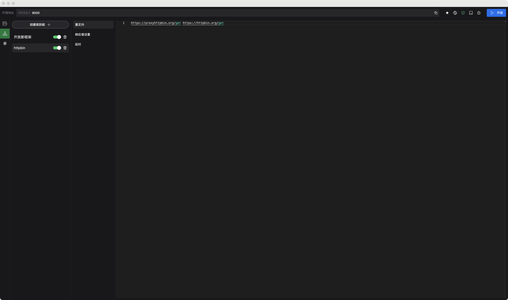
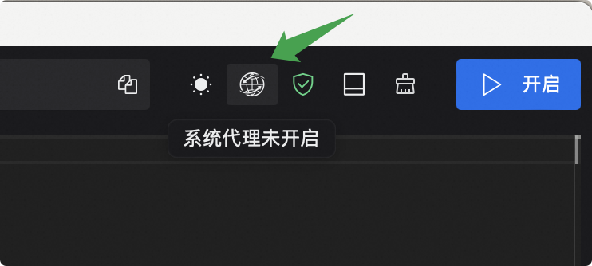

## Proxyman

[](https://github.com/stickmy/proxyman/actions/workflows/release.yml)

A http network debugging tool written by rust.




## Features

- Support http1, http2, https connections.
- Support request redirect, request delay, response value setting.

## Platform support

Support MacOS(x64, aarch64) only, the Windows is not supported currently.

## chrome with https proxy



If you turned on the global system proxy, when you visit websites based on https, you'll get `NET::ERR_CERT_AUTHORITY_INVALID` error, due to the proxyman using self-signed tls certificates, which chrome does not validate for security reason.

To resolve this issue, follow these steps blow.

- First, click on the website page with your mouse.
- Second, typing the following 12 characters: `thisisunsafe` on keyboard, yeah, there's not any reaction, just like typing a password on a linux terminal.
- Third, press `enter` and the website will be load.

## Rules usages

### Redirect

Each `Redirect` rule is split by a line and divided into two parts by spaces, the first part being the `regex` to be matched and the second part being the final address to be redirected.

**example**

```text
https://proxyhttpbin.org/(.*) https://httpbin.org/$1
```

### Delay

The format is as same as `Redirect` rule, the difference is the second part is the delaying milliseconds.

**example**

```text
# the-uri delaying-milliseconds
https://uri.com 200
```

### Response

The format is as same as `Redirect` rule, the difference is the second part is the `Value File` name. Under the hood, the `Response` rule will find the file which named the second part in value files, then parsing the file content as the response of this request.

```text
https://uri.com uri-response-example
```

#### Value files


The first line is http version and status code. Then the next parts is the response headers until the empty line appear. After the empty line, the parts is response body.

### Troubleshooting

- If you get error messages such as broken dmg files with Apple Silicon machines. Please enter the following command in terminal and restart proxyman.

```sh
sudo xattr -d com.apple.quarantine /Applications/Proxyman.app
```
